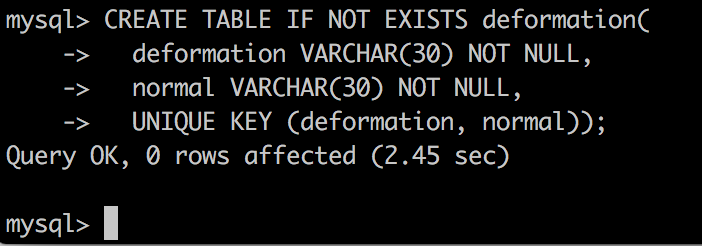

# WoreNet-SQL
This is a tutorial that help you practice MySQL syntax and interactive with nodejs.

In this repos, we will use [WordNet](https://wordnet.princeton.edu/) as our source files. And create tables and read them from disk to database.

### how to learn this tutorial?
- `./dict` store all source files which were downloaded from [WordNet](https://wordnet.princeton.edu/).
- however, some files are very big, if you want to get a priview of them, you can checkout `./preview`. This will store top 20 lines of source files.
- `./nodejs` store scripts written by nodejs which can help you read those files to mysql.

### before this tutorial
- You should have MySQL installed and understand basic syntax.
- Familiar with nodejs.

# SQL
at first, we need get a overview about wordnet and our database.

### Create database
Of course, we need create database in MySQL to store our tables.
Open you MySQL shell, and execute follow commands.
``` sql
CREATE DATABASE wordnet;

USE wordnet;
```
## Word deformation
In English, each word may have many deformation. 
Such as `farther -> far` `further -> far`.

In `adj.exc` `verb.exc` `adv.exc` and `noun.exc`, files store those relationship, you can checkout those preview. So we need to create a table to store those information.

So what column should we have? 
Well, we need a `deformation` field and a `normal` filed to save those. And then , you can add an extra filed to indicate it is a adjective or verb. But I personally think it is not necessary.

So we can do like this:
``` sql
CREATE TABLE IF NOT EXISTS deformation(
  deformation VARCHAR(30) NOT NULL, 
  normal VARCHAR(30) NOT NULL,
  UNIQUE KEY (deformation, normal));
```

Yeah, we just create our table. If we want to insert some data to this table we may use:
``` sql
INSERT INTO deformation(deformation, normal) 
  VALUES ('artier', 'arty');
```
Now , you can checkout `./nodejs/README.md#deformation` to implement this will nodejs.

## word and index
`index.noun` `index.adj` `index.verb` and `index.adv` give each word an ID, each line of those files look like this:
```
frisch n 3 1 @ 3 0 10983172 10983007 10982870  
```
- `frisch` tell us which word it is
- `n` indicate is a noun. in `index.noun`, all of them is `n`; in `index.adv`, all of them is `r`.
- `3` indicates it has three means; index of then are last three numbers.
- `1 @ 3 0` is useless.
- `10983172 10983007 10982870` is the indexes of this word in data.noun or data.*.

So, in this case, we may need three fields:
- word: store out word, such as `frisch`
- class: indicates it is a verb or adjective
- means_index: such as `10983172 10983007 10982870`. Because MySQL can not store array, so we need combine them as a string.
``` sql
CREATE TABLE IF NOT EXISTS word_index (
  word VARCHAR(300) NOT NULL,
  class CHAR(1) NOT NULL,
  means_index VARCHAR(3000) NOT NULL,
  UNIQUE KEY (word, class));
```
I set max size of means_index to 3000 because there is a complex word which is `break`, It has many means.

``` sql
INSERT INTO word_index(word, class, means_index) 
  VALUES ('frisch', 'n', '10983172 10983007 10982870');
```

## data
Now this is our most valueful part, the real means of any word. There are stored at `data.noun` `data.verb` ...

this is a random line of source file.
```
00001740 03 n 01 entity 0 003 ~ 00001930 n 0000 ~ 00002137 n 0000 ~ 04424418 n 0000 | that which is perceived or known or inferred to have its own distinct existence (living or nonliving) 
```
- `00001740` is id of a word
- `entity` is word itself
- and there are many complex field, we don't care
- after symbol `|`, is means of those verb, so we may write sql like this.
``` sql
CREATE TABLE IF NOT EXISTS word (
  word VARCHAR(300) NOT NULL,
  class CHAR(1) NOT NULL,
  means VARCHAR(6000) NOT NULL);

INSERT INTO word(word, class, means_index) 
  VALUES ('entity', 'n', 'that which is perceived or known or inferred to have its own distinct existence (living or nonliving)');
```

Ok, we just analysis the table fields and some SQL statement. Now you can checkout `./nodejs`, let's implement them!!!