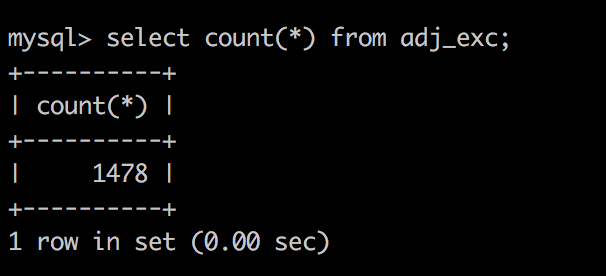

before we start, you should checkout
- we will use npm package `mysql` to connect MySQL from nodejs, if you never use this, you can checkout https://github.com/mysqljs/mysql, you just need to konn basic usage.
- I write my MySQL information at package.json, you should change `host``user` to youself's

- how to read lines form a text file? if you have any problem, you can checkout `./readLine` folder.

## read to db
First, Let's load `adj.exc` in `dict` folder and sent to MySQL. To do this, we need:
- connect to MySQL 
- create table
  of cause, you can create table from shell directly
- read `adj.exc` line by line
- get deformation and normal word from each line
  some of those word may like this: `all-arounder`. I personally think they are useless, so we need filter them.
- insert to database

And SQL syntax we have discuss before, You can read adj.exe.js, I leaves comments there.

After you execute `adj.exc.js`, we can checkout our database:

If you see this, it mean we are successful. If you have some problem, just leave open an issue.

## read many
With same way, I think you can read `adv.exc` `noun.exc` to database by youself,try to do this. Or you can check `adv.exc.js` `noun.exc.js`

## read data
Then we need read `data.adj` `data.noun` ... to database, so we need write `data.adj.js` `data.noun.js` ... wait, wait. We just do many repeatable job. Read `data.adj` and read `data.noun` there are similar.

The difference between them is they have different source file location. We can write a function which receive an file path. So checkout my `data.*.js`, I leave comments there.

